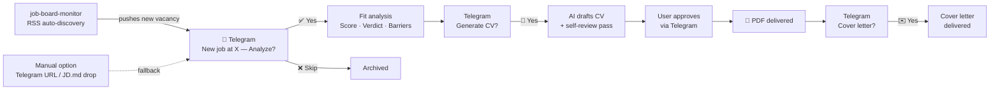
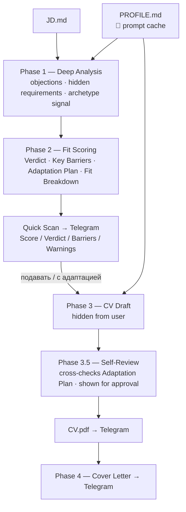
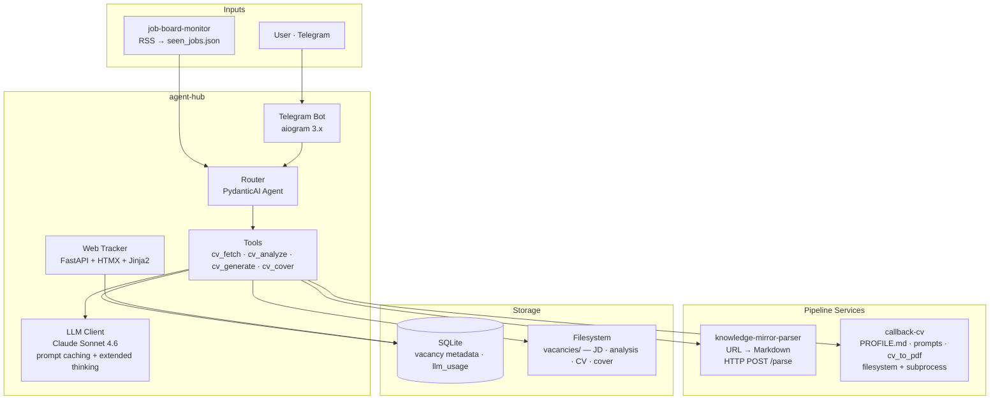

# agent-hub

Personal multi-agent hub for workflow automation.  
**CV pipeline is the first agent** — more domains planned. The hub orchestrates purpose-built services that were already developed independently; agent-hub connects them into automated pipelines.

> 🚧 Actively in development

---

## User Journey — CV Agent

New jobs are discovered **automatically** via RSS. The agent notifies via Telegram — user only makes decisions.  
Manual URL input is an option, not the default.



**User's only job:** approve or skip. Everything else runs automatically.

---

## AI Pipeline

Five-phase Claude API pipeline. `PROFILE.md` cached — charged once per session window.



**3-way verdict:** подавать · подавать с адаптацией · не подавать  
**Fit Breakdown:** per-requirement ✅/⚠️/❌ table — pet-projects never equal commercial experience  
**Archetype-aware:** JD signals Founder Proxy vs Executor → different CV framing per vacancy

---

## Architecture



| Layer | Tech |
|-------|------|
| AI | Claude Sonnet 4.6 · PydanticAI · prompt caching |
| UI | Telegram (aiogram 3.x) · Web tracker (FastAPI + HTMX) |
| HTTP | httpx async |
| Storage | SQLite + filesystem |
| Config | `config/profile.yaml` · `config/llm.yaml` |
| Deploy | Docker Compose — agent-hub + kmp-service |

---

## Built on existing tools

The agent's value is **orchestration** — it connects three independently built services into a single pipeline. Each service was useful alone; together they enable automation that none could do individually.

| Repo | What it brings | Interface |
|------|----------------|-----------|
| `knowledge-mirror-parser` | URL → clean Markdown — any job board becomes parseable input | HTTP `POST /parse` |
| `callback-cv` | Candidate profile · tailored prompts · PDF generation — the CV engine | Filesystem + subprocess |
| `job-board-monitor` | RSS watcher — turns job boards into a real-time feed | `seen_jobs.json` |

---

## Quick Start

```bash
cp .env.example .env          # ANTHROPIC_API_KEY + TELEGRAM_BOT_TOKEN
docker-compose up -d          # agent-hub + kmp-service
python agent.py               # run without Docker
uvicorn web.api:app --reload  # web tracker → localhost:8080
```
