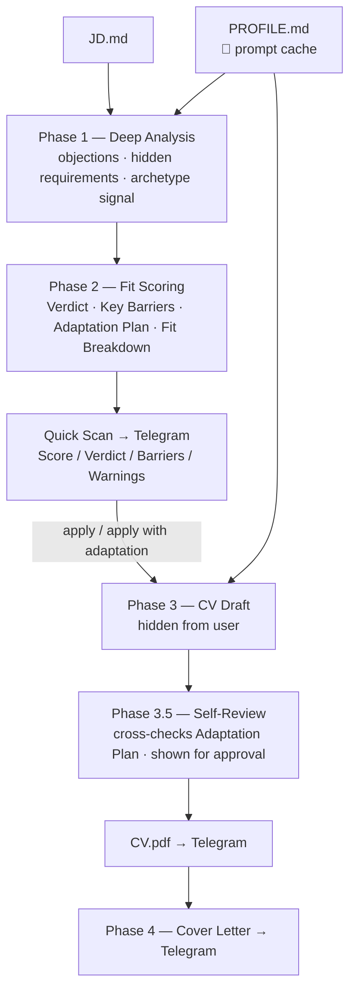
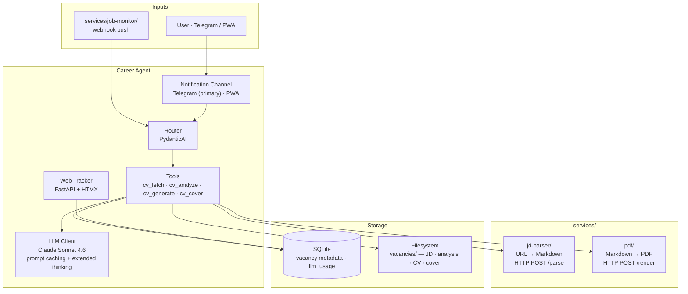

# Hiring is broken. You can fix your side.

**Career Agent** — *For your next career move*

Job search has become needlessly hard. Employers bury their real pain inside generic JDs. Candidates fire off generic CVs hoping something lands. Both sides drown in noise.

**Our belief:** a good match is a conversation of relevance. The employer states the problem they need solved. The candidate understands it and responds with their strongest, most relevant evidence.

**Today** Career Agent serves the candidate side: it reads the employer's real intent out of the JD, judges honest fit, and surfaces the candidate's strongest relevant story — or tells them to walk away.

**North star:** close the loop on both sides, so employers and candidates reach the most relevant offers to each other.

---

## Who it's for

**Product Managers, Product Owners, Project Managers** — in active job search (passive search as secondary).

Built for PMs specifically: fit analysis understands PM archetypes (Delivery vs Discovery, Execution vs Founder Proxy), evaluates PM-specific experience signals, and adapts CV framing to what the role actually needs.

---

## The Problem

Job seekers spend hours tailoring CVs **before** knowing if they're even a strong candidate.

Most tools help you write faster. This system answers two questions, in order:

1. **Should you apply?** — an honest read of the vacancy and your real fit. Weak odds → it tells you to skip.
2. **How do you win this one?** — if worth it, a CV that puts your strongest, most relevant sides forward.

The leverage is your profile: onboard once, and Career Agent turns deep JD analysis into a winning pitch — automatically, for every vacancy.

---

## Product Vision

**Career Agent is a focused vertical service** — purpose-built for PM job search. Tight pipeline by design: each phase solves a specific problem for the job seeker, nothing more.

---

## How it works

A **job counselor**, not a CV generator. Two distinct layers of value:

**Layer 1 — Decision support**
Read the vacancy deeply. Understand the employer's real pain, not just the listed requirements. Give the candidate an honest answer: *is this worth your time?* If the fit is weak — say so clearly, explain why, and save them the effort. No false encouragement.

**Layer 2 — Execution support**
If the answer is yes: prepare the candidate's best possible pitch. Not a generic CV about them — a targeted story about *why they are the answer to this employer's specific problem*, told through their strongest, most relevant experience.

The counselor is only as good as what it knows about the candidate. That's why onboarding matters: the deeper the profile, the sharper the story.

---

## User Journey

New jobs are discovered **automatically** via RSS. The user is notified and only makes decisions — approve or skip.  
Manual URL input is an option, not the default.

**The user's only job:** approve or skip. Everything else runs automatically.

---

## AI Pipeline

Five-phase Claude API pipeline. All static system content — `PROFILE.md` **and** every phase prompt — is prompt-cached; only the per-vacancy text (JD + prior-phase output) is charged at full rate.

Phase prompts are **skill-type-specific**: each user's `PROFILE.md` carries a `skill_type` field (e.g. `pm`, `generic`) that routes all five phases to `prompts/[skill_type]/`. PM analysis understands archetypes, Founder Proxy signals, and delivery framing. Generic analysis is role-agnostic — suitable for any non-PM role.

**3-way verdict:** apply · apply with adaptation · don't apply  
**Fit Breakdown:** per-requirement ✅/⚠️/❌ table — pet-projects never equal commercial experience  
**Archetype-aware:** JD signals Founder Proxy vs Executor → different CV framing per vacancy

---

## Product Decisions

| Decision | Alternative | Reason |
|----------|-------------|--------|
| **Decision-first pipeline** — analyze fit before generating anything | Generate CV for every vacancy | Effort should follow a go/no-go verdict, not precede it. Don't optimize a document the user shouldn't send. |
| **RSS-first workflow** — jobs are pushed to the user | Manual vacancy search | Users should *evaluate* opportunities, not spend time *finding* them. |
| **Telegram as primary UI** | Web app / dedicated client | Zero install, already in the user's pocket, native push + inline approve/skip buttons. The interaction is decisions, not browsing. |
| **Channel-agnostic architecture** | Telegram-only forever | Telegram is primary today (CIS/EU). PWA and WhatsApp added as adapters when needed — tools layer unchanged. |
| **Monorepo — all services inside** | Permanent external dependencies | All user-built services live inside `services/`. Audit before migrating — cut dead code, keep only what the pipeline needs. |
| **Human-in-the-loop on irreversible steps** | Full auto-apply | The user owns the apply/skip and CV-approval calls. Automation removes toil, not judgment. |

---

## Architecture

| Layer | Tech |
|-------|------|
| AI | Claude Sonnet 4.6 · PydanticAI · prompt caching (profile + all phase prompts) |
| UI | Telegram (aiogram 3.x) · Web tracker (FastAPI + HTMX) |
| HTTP | httpx async |
| Storage | SQLite + filesystem |
| Config | `config/profile.yaml` · `config/llm.yaml` |
| Deploy | Docker Compose — career-agent · services/ |
