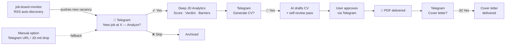
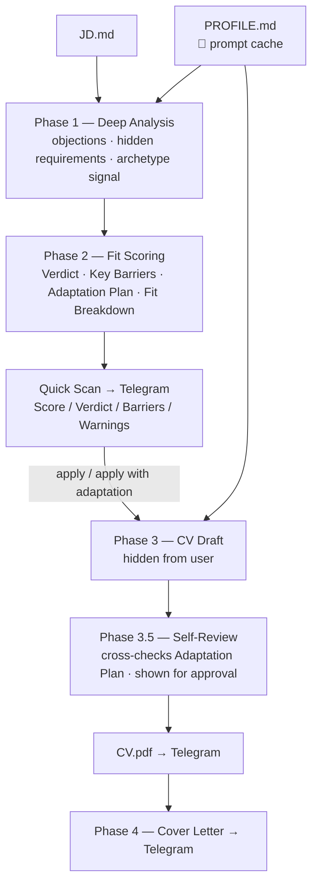
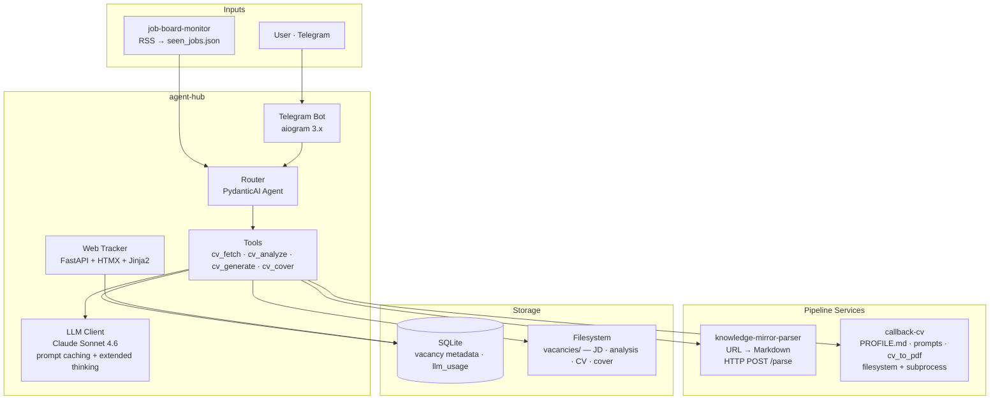

# agent-hub

**A multi-agent AI operations platform.** Each agent automates one domain end-to-end; the platform orchestrates independent services into workflows. New agents are added over time — this is a growing platform, not a single tool.

### Agent roster

| # | Agent | Domain | Status |
|---|-------|--------|--------|
| 1 | **CV Agent** | Job applications — analyze fit, decide, tailor CV | 🟢 In production |
| 2 | — | *Personal notes, knowledge & content classification and management* | ⚪ Upcoming |

> 🚧 **Actively in development.** The platform is expanding — the CV Agent is the first of many.

---

## Hiring is broken. Let's fix it.

Job search has become needlessly hard. Employers bury their real pain inside generic JDs. Candidates fire off generic CVs hoping something lands. Both sides drown in noise.

**Our belief:** a good match is a conversation of relevance. The employer states the problem they need solved. The candidate understands it and responds with their strongest, most relevant evidence.

**Today** the platform serves the candidate side: it reads the employer's real intent out of the JD, judges honest fit, and surfaces the candidate's strongest relevant story — or tells them to walk away.

**North star:** close the loop on both sides, so employers and candidates reach the most relevant offers to each other.

---

## Who it's for

**Product Managers, Product Owners, Project Managers** — in active job search (passive search as secondary).

Built for PMs specifically: fit analysis understands PM archetypes (Delivery vs Discovery, Execution vs Founder Proxy), evaluates PM-specific experience signals, and adapts CV framing to what the role actually needs.

---

## The Problem

Job seekers spend hours tailoring CVs **before** knowing if they're even a strong candidate.

Most tools help you write faster. This system answers two questions, in order:

1. **Should you apply?** — an honest read of the vacancy and your real fit. Weak odds → it tells you to skip.
2. **How do you win this one?** — if worth it, a CV that puts your strongest, most relevant sides forward.

The leverage is your profile: onboard once, and the platform turns deep JD analysis into a winning pitch — automatically, for every vacancy.

---

## Product Vision

**Agent Hub is a personal AI operations platform** — a home for domain agents that grows over time (see the [agent roster](#agent-roster) above).

**Core idea:** specialized services remain independent, reusable products. Agent Hub orchestrates them into end-to-end workflows — without absorbing them. Adding a new domain means adding an agent, not rebuilding the platform.

---

## What the CV Agent does

A **job counselor**, not a CV generator. Two distinct layers of value:

**Layer 1 — Decision support**
Read the vacancy deeply. Understand the employer's real pain, not just the listed requirements. Give the candidate an honest answer: *is this worth your time?* If the fit is weak — say so clearly, explain why, and save them the effort. No false encouragement.

**Layer 2 — Execution support**
If the answer is yes: prepare the candidate's best possible pitch. Not a generic CV about them — a targeted story about *why they are the answer to this employer's specific problem*, told through their strongest, most relevant experience.

The counselor is only as good as what it knows about the candidate. That's why onboarding matters: the deeper the profile, the sharper the story.

---

## User Journey — CV Agent

New jobs are discovered **automatically** via RSS. The agent notifies via Telegram — the user only makes decisions.  
Manual URL input is an option, not the default.

**The user's only job:** approve or skip. Everything else runs automatically.

---

## AI Pipeline

Five-phase Claude API pipeline. All static system content — `PROFILE.md` **and** every phase prompt — is prompt-cached; only the per-vacancy text (JD + prior-phase output) is charged at full rate.

**3-way verdict:** apply · apply with adaptation · don't apply  
**Fit Breakdown:** per-requirement ✅/⚠️/❌ table — pet-projects never equal commercial experience  
**Archetype-aware:** JD signals Founder Proxy vs Executor → different CV framing per vacancy

---

## Product Decisions

| Decision | Alternative | Reason |
|----------|-------------|--------|
| **Decision-first pipeline** — analyze fit before generating anything | Generate CV for every vacancy | Effort should follow a go/no-go verdict, not precede it. Don't optimize a document the user shouldn't send. |
| **RSS-first workflow** — jobs are pushed to the user | Manual vacancy search | Users should *evaluate* opportunities, not spend time *finding* them. |
| **Telegram as primary UI** | Web app / dedicated client | Zero install, already in the user's pocket, native push + inline approve/skip buttons. The interaction is decisions, not browsing. |
| **Independent services** | Single monolith application | Each service stays reusable and independently evolvable. The parser, CV engine, and monitor are products in their own right. |
| **Orchestration over absorption** | Rebuild every capability inside the hub | Reuse existing, battle-tested tools. The hub's value is connecting them, not replacing them. |
| **Human-in-the-loop on irreversible steps** | Full auto-apply | The user owns the apply/skip and CV-approval calls. Automation removes toil, not judgment. |

---

## Architecture

| Layer | Tech |
|-------|------|
| AI | Claude Sonnet 4.6 · PydanticAI · prompt caching (profile + all phase prompts) |
| UI | Telegram (aiogram 3.x) · Web tracker (FastAPI + HTMX) |
| HTTP | httpx async |
| Storage | SQLite + filesystem |
| Config | `config/profile.yaml` · `config/llm.yaml` |
| Deploy | Docker Compose — agent-hub + kmp-service |

---

## Built on existing tools

The platform's value is **orchestration** — it connects three independently built services into one pipeline. Each was useful alone; together they enable automation none could do individually.

| Repo | What it brings | Interface |
|------|----------------|-----------|
| `knowledge-mirror-parser` | URL → clean Markdown — any job board becomes parseable input | HTTP `POST /parse` |
| `callback-cv` | Candidate profile · tailored prompts · PDF generation — the CV engine | Filesystem + subprocess |
| `job-board-monitor` | RSS watcher — turns job boards into a real-time feed | `seen_jobs.json` |
