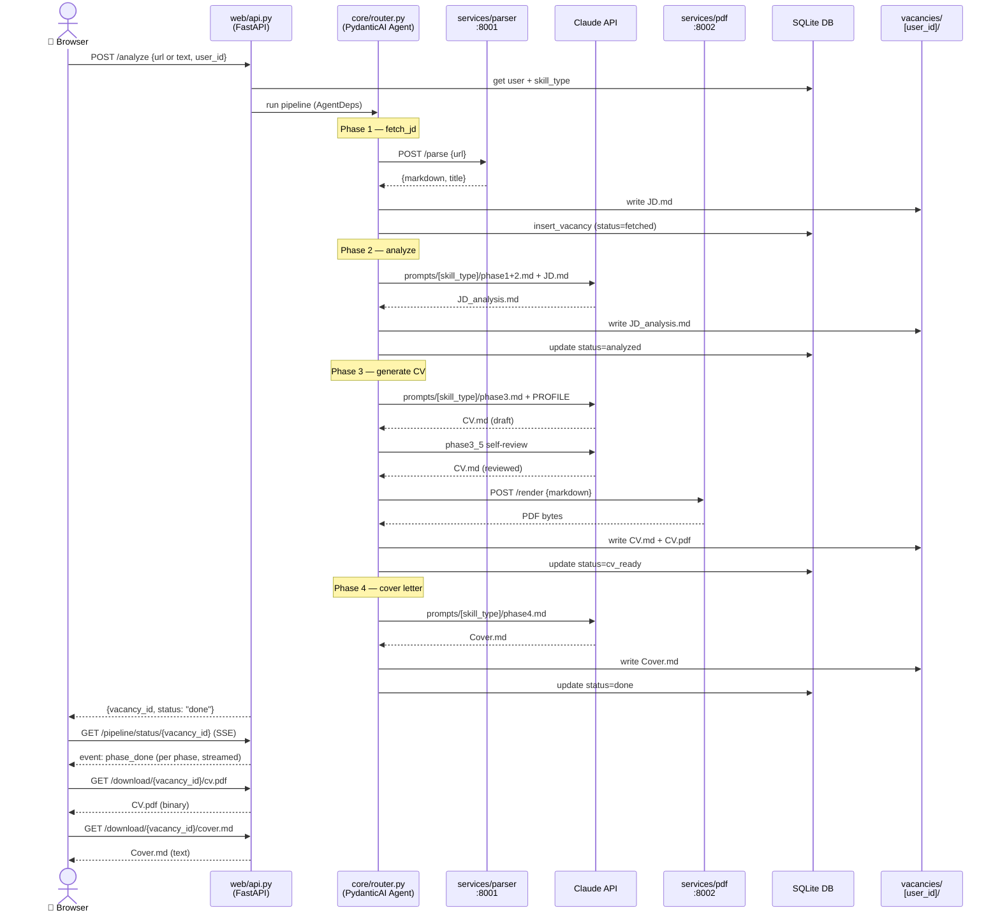
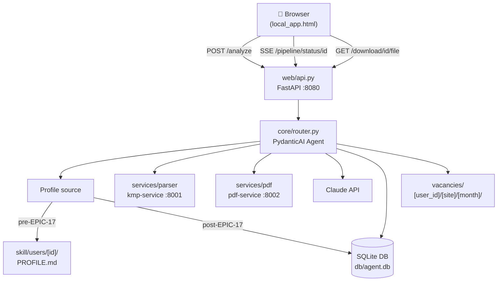

# EPIC-19 — Local execution mode (desktop / local web app)

**Status:** 📋 Planned
**Phase:** Phase 7 of PIVOT-PLAN
**Priority:** P1
**Last updated:** 2026-06-01

---

## User Story

```
As a power user or developer
I want to run the full CV pipeline from a local web UI without Telegram
So that I can use Career Agent as a desktop tool — faster iteration, no bot latency, no phone required
```

---

## Acceptance Criteria

**Given** the user opens the local web UI
**When** they paste or drop a JD URL or text
**Then** the pipeline starts and phase progress is shown in real time (SSE stream)

**Given** the pipeline completes
**When** all phases are done
**Then** CV PDF and cover letter are available for download directly from the browser

**Given** `LOCAL_MODE=true` in settings
**When** the `skill/` pipeline runs via Claude Code slash commands
**Then** artifacts are written to `vacancies/[user_id]/` and the local API is used instead of Telegram

**Given** EPIC-17 (Onboarding) is complete
**When** the local app loads the profile
**Then** it reads from DB — not from `PROFILE.md` file

---

## Edge Cases

- No DB profile yet (pre-EPIC-17) → local app falls back to `skill/users/[id]/PROFILE.md`
- Pipeline fails mid-run → UI shows error state per phase; partial artifacts still downloadable
- Two browser tabs run pipeline simultaneously → each gets independent SSE stream; no cross-contamination

---

## Out of Scope

- Auth / login for local app (single-user, local only)
- Mobile / PWA (separate phase)
- Packaged binary (PyInstaller) — overkill for personal tool

---

## Notes for Engineering

- Extend existing `web/api.py` + `web/templates/` — not a new app
- New endpoint: `POST /analyze` — accepts JD URL or text, triggers pipeline for active user
- New endpoint: `GET /pipeline/status/{vacancy_id}` — SSE stream of phase progress events
- New template: `web/templates/local_app.html` — HTMX: JD drop zone, user selector, phase progress, download links
- `skill/` bridge: `LOCAL_MODE=true` env var → write to `vacancies/[user_id]/`, call local endpoints
- Profile convergence: pre-EPIC-17 uses filesystem PROFILE.md; post-EPIC-17 uses DB — no breaking change during transition

---

## Dependencies

- EPIC-13 (user_id) — required
- EPIC-17 (DB profiles) — partial dependency; local app works before EPIC-17 with file fallback

---

## Architecture

### Request flow



### Component map



### Profile loading (transition)

| Stage | Profile source |
|-------|---------------|
| Pre-EPIC-17 | `skill/users/[id]/PROFILE.md` — read from filesystem |
| Post-EPIC-17 | DB `users.profile_md` — written during onboarding |
| Transition | `AgentDeps` checks DB first → falls back to file |

---

## Tasks

| # | Task | Status |
|---|------|--------|
| 1 | `web/api.py` — `POST /analyze` endpoint | 📋 |
| 2 | `web/api.py` — `GET /pipeline/status/{vacancy_id}` SSE | 📋 |
| 3 | `web/templates/local_app.html` — JD drop zone + phase progress + download | 📋 |
| 4 | `skill/` bridge mode (`LOCAL_MODE=true`) | 📋 |
| 5 | Post-EPIC-17: local app reads profile from DB | 📋 |
