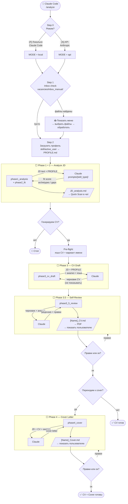
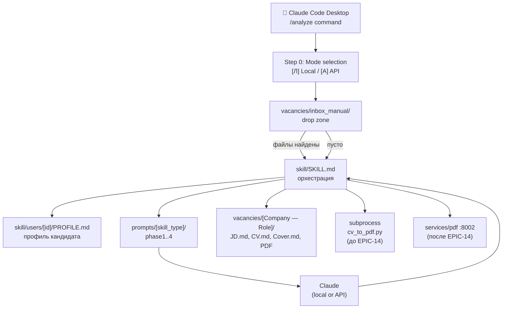

# Local Execution Mode — Claude Code Skill

**Что:** полный CV-pipeline прямо в Claude Code desktop. Никакого Telegram, никакого бота, никакой инфраструктуры.  
**Как:** slash-команда `/analyze` → Claude Code IS the agent — читает профиль, прогоняет фазы, пишет файлы.  
**Для кого:** разработчик / сам кандидат — быстрый разбор вакансии без поднятия docker compose.

---

## Запуск

```bash
# В Claude Code — просто написать:
/analyze

# Или триггер через естественный язык:
# "проанализируй вакансию", "сделай CV", "разбор вакансии", "job fit"
```

---

## Команды

| Команда | Действие |
|---------|---------|
| `/analyze` | **выбрать режим** → inbox → активный пользователь → начать |
| `/analyze -u [id\|slug]` | **выбрать режим** → переключить пользователя → inbox → начать |
| `/analyze -l` | показать список пользователей → стоп (режим не спрашивается) |
| `/analyze -inbox` | показать содержимое inbox → стоп (режим не спрашивается) |
| `/analyze -pdf [name?]` | перегенерировать PDF для вакансии → стоп |

---

## Как это работает (пошагово)

**Step 0 — Режим выполнения (всегда первый шаг)**
```
Режим аналізу:
  [Л] Локально — Claude Code (без Anthropic API)
  [A] API — Anthropic Claude (з витратами токенів)
```
Выбор режима применяется ко всей сессии — всем фазам и всем файлам из inbox.
Только `-l` и `-inbox` пропускают этот шаг (read-only, pipeline не запускается).

**Step 1 — Inbox check**
Сканирует `vacancies/inbox_manual/` на `.md`/`.txt` файлы.
Если найдены → предлагает обработать (режим уже выбран).
Если пусто → переходит к Step 2.

**Step 2 — Загрузка профиля**
Читает `skill/active_user` → ID → `skill/users/[id]/PROFILE.md`.

**Step 3–N — Pipeline**
1. Пользователь вставляет URL или текст JD (либо обрабатывается файл из inbox)
2. **Phase 1 + 2** запускаются автоматически — без подтверждения
   - Результат сохраняется в `JD_analysis.md`
   - В чат выводится только **Quick Scan** блок
   - Вопрос: _«Генерируем CV?»_
3. После подтверждения — **pre-flight** (язык CV + вариант имени, один вопрос)
4. **Phase 3** — черновик CV (не показывается пользователю)
5. **Phase 3.5** — self-review → показать пользователю → правки → сохранить `[Name]_CV.md` → сгенерировать PDF
6. Вопрос: _«Переходим к cover?»_
7. **Phase 4** — cover letter → правки → сохранить `[Name]_Cover.md`

**Правило: один вопрос за раз. Никогда два вопроса в одном сообщении.**

---

## Структура файлов

Папка вакансии: `vacancies/[user_id]/[Company — Role]/`

`[user_id]` = из `skill/active_user` (например `001`).
`[Company — Role]` = из анализа JD. Формат: `Acme Corp — Product Manager` (em dash).

```
vacancies/
├── inbox_manual/                             ← drop zone для ручных вакансий
│   ├── Stripe — PM.md                        ← JD текст или URL в первой строке
│   ├── some_url.txt                          ← один URL → fetch + pipeline
│   └── processed/                            ← после обработки файлы сюда
│
└── 001/                                      ← user_id
    └── Acme Corp — Product Manager/          ← создаётся при обработке
        ├── JD.md                             ← JD (из URL или вставлен вручную)
        ├── JD_analysis.md                    ← Phase 1 + 2 + 3.5 self-review
        ├── [Name]_CV.md                      ← английское CV
        ├── [Name]_CV_UA.md                   ← украинское CV (если запрошено)
        ├── [Name]_CV.pdf                     ← PDF
        ├── [Name]_Cover.md                   ← cover (английский)
        └── [Name]_Cover_UA.md                ← cover (украинский, если запрошено)
```

**Inbox → user folder:** файлы из `inbox_manual/` после обработки сохраняются в `vacancies/[user_id]/[Company — Role]/` — тот же стандарт.
**Inbox naming tip:** имя файла `Company — Role.md` (em dash) → используется как имя папки вакансии напрямую.

---

## Профиль пользователя

```
skill/
├── active_user          ← ID активного пользователя (одна строка)
├── users.yaml           ← список пользователей {id, slug, name, profile_path}
└── users/
    └── [id]/
        └── PROFILE.md   ← опыт, навыки, настройки (language, skill_type, name variants)
```

Переключить пользователя: `/analyze -u kosar` или `/analyze -u 1`

---

## Язык CV и имя

- **Язык CV** = язык вакансии (English JD → English CV). Не зависит от настроек пользователя.
- **Имя** = берётся из `PROFILE.md → ## Name variants`. Если JD не на английском — спросить вариант.
- Если JD не на английском: предложить три варианта — English / JD-язык / Оба.

---

## PDF-генерация

**Сейчас** (до EPIC-14 на локальной машине):
```bash
CAREER_AGENT_FONTS=fonts/ python ../callback-cv/cv_to_pdf.py vacancies/[user_id]/[Company — Role]/[Name]_CV.md
```

**После EPIC-14** (`services/pdf` запущен):
```bash
# Claude Code делает это автоматически — POST markdown → http://localhost:8002/render → PDF bytes
docker compose up pdf-service -d
```

---

## Промпты

Все фазы роутятся через `skill_type` из `PROFILE.md → ## Settings`:

| Фаза | Файл |
|------|------|
| Phase 1 | `prompts/[skill_type]/phase1_analysis.md` |
| Phase 2 | `prompts/[skill_type]/phase2_fit.md` |
| Phase 3 | `prompts/[skill_type]/phase3_cv_draft.md` |
| Phase 3.5 | `prompts/[skill_type]/phase3_5_review.md` |
| Phase 4 | `prompts/[skill_type]/phase4_cover.md` |

Доступные `skill_type`: `pm` (активен), `generic` (в разработке).

---

## Отличие от Telegram-бота

| | Claude Code skill | Telegram bot |
|--|------------------|-------------|
| Триггер | `/analyze` или фраза | RSS / команда в Telegram |
| Профиль | `skill/users/[id]/PROFILE.md` | DB (после EPIC-17) |
| Запись в DB | ❌ нет | ✅ да |
| PDF | subprocess / HTTP (EPIC-14) | CVAdapter → HTTP |
| Мультипользователь | `users.yaml` + `active_user` | DB `users` table |
| Когда использовать | быстрый разбор, без инфраструктуры | полный prod-pipeline |

---

## Связанные документы

- Epic: [`docs/delivery/Epics/EPIC-19-local-execution.md`](delivery/Epics/EPIC-19-local-execution.md)
- Онбординг (источник профиля): [`docs/delivery/Epics/EPIC-17-onboarding.md`](delivery/Epics/EPIC-17-onboarding.md)
- Skill types: [`skill/SKILL_TYPES.md`](../skill/SKILL_TYPES.md) _(gitignored — локальный файл)_

---

---

## Диаграммы

### Pipeline flow



### Component map



### Источник профиля (переход)

| Этап | Источник |
|------|---------|
| Сейчас (pre-EPIC-17) | `skill/users/[id]/PROFILE.md` — filesystem |
| После EPIC-17 | DB `users.profile_md` — запись при онбординге |
| Переход | `AgentDeps` проверяет DB → если нет, читает файл |
