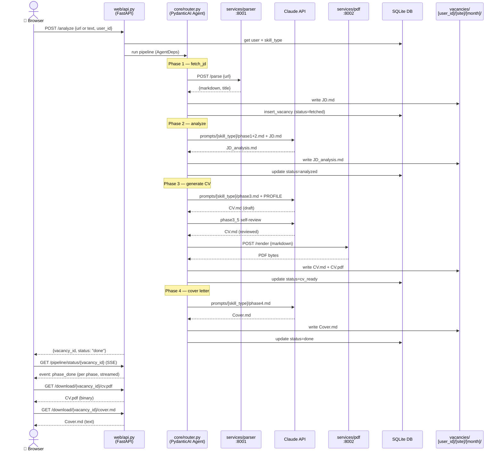
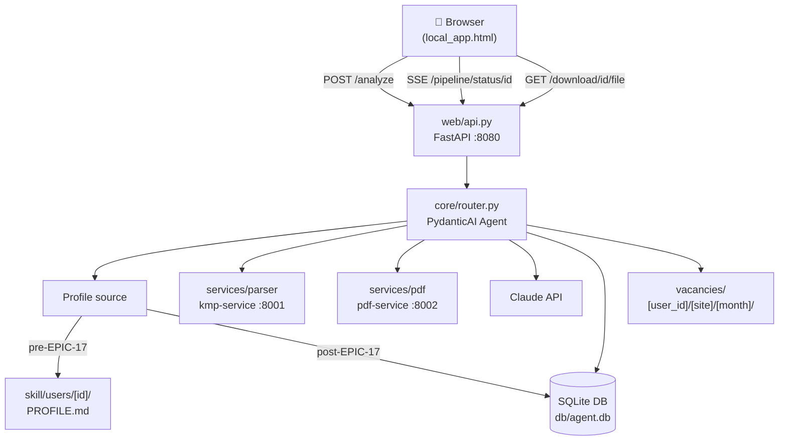

# Local App — Architecture

**What:** Desktop-mode pipeline runner. No Telegram required. Browser UI → full CV pipeline.
**Who:** Power user / developer / admin. Single-user, local only.
**Entry point:** `uvicorn web.api:app --reload` → `http://localhost:8080`

---

## Request flow

---

## Component map

---

## Profile loading (transition)

| Stage | Source |
|-------|--------|
| Pre-EPIC-17 | `skill/users/[id]/PROFILE.md` — filesystem |
| Post-EPIC-17 | DB `users.profile_md` — written during onboarding |
| Transition | `AgentDeps` checks DB first → falls back to file |

---

## Related

- Epic: [`docs/delivery/Epics/EPIC-19-local-execution.md`](delivery/Epics/EPIC-19-local-execution.md)
- Onboarding (profile source): [`docs/delivery/Epics/EPIC-17-onboarding.md`](delivery/Epics/EPIC-17-onboarding.md)
