# Career Agent — System Flow

> How the system works: entry points, decision logic, and what gets produced.
> Two ways in, one pipeline, one goal — "should you apply, and how do you win it?"

---

## System overview

```mermaid
flowchart TD

    %% ─── ENTRY POINTS ────────────────────────────────────────────────────────

    subgraph ENTRY["Entry points"]
        direction LR
        RSS["📡 RSS\nauto-discovery\nnew jobs stream"]
        TG_IN["💬 Telegram\nURL / JD text\nfrom user"]
        CC["💻 Claude Code\n/analyze\ndesktop mode"]
    end

    %% ─── TELEGRAM PATH ───────────────────────────────────────────────────────

    RSS --> TG_NOTIFY["🔔 Telegram notification\n'New job at X — analyze?'"]
    TG_IN --> TG_NOTIFY

    TG_NOTIFY -->|"❌ Skip"| ARCHIVE(["📁 Archived"])
    TG_NOTIFY -->|"✅ Yes"| TG_PROFILE["Load profile\nfrom DB\n(post EPIC-17)"]

    %% ─── CLAUDE CODE PATH ────────────────────────────────────────────────────

    CC --> MODE{"Step 0\nExecution mode?"}
    MODE -->|"[Л] Local\nClaude Code\nno API costs"| INBOX
    MODE -->|"[A] API\nAnthropic\ntokens billed"| INBOX

    INBOX{"Step 1\nInbox check\nvacancies/inbox_manual/"}
    INBOX -->|"files found"| INBOX_MENU["📥 Show file list\nselect all / pick / skip"]
    INBOX -->|"empty"| JD_INPUT
    INBOX_MENU --> JD_INPUT

    JD_INPUT["JD input\nURL → fetch → JD.md\nor paste JD text directly"]
    JD_INPUT --> CC_PROFILE["Load profile\nfrom skill/users/[id]/PROFILE.md"]

    %% ─── CONVERGE ────────────────────────────────────────────────────────────

    TG_PROFILE --> READY
    CC_PROFILE --> READY

    READY["✅ Profile + JD ready\nskill_type determined\n(pm / generic / ...)"]

    %% ─── PHASE 1 + 2: ANALYSIS ───────────────────────────────────────────────

    READY --> P12

    subgraph P12["Phase 1 + 2 — Analysis (auto-run, no confirmation)"]
        direction LR
        DEEP["Deep JD read\nreal pain · hidden requirements\narchetype signal\nPrompt: phase1_analysis.md"] --> FIT["Fit scoring\ncandidate vs vacancy\nper-requirement ✅⚠️❌\nPrompt: phase2_fit.md"]
        FIT --> SAVE12[/"→ JD_analysis.md\n(full output, silent save)"/]
    end

    P12 --> QUICK_SCAN["Quick Scan — shown in chat\nScore X/10 · Verdict · Barriers · Warnings"]

    %% ─── GO / NO-GO DECISION ─────────────────────────────────────────────────

    QUICK_SCAN --> VERDICT{"Verdict?"}
    VERDICT -->|"🚫 Don't apply\nblockers found"| NO_APPLY(["🛑 Stop\nanalysis saved\nno CV generated"])
    VERDICT -->|"⚠️ Apply with adaptation\nor ✅ Apply"| PREFLIGHT

    %% ─── PRE-FLIGHT ──────────────────────────────────────────────────────────

    PREFLIGHT["Pre-flight (ask once)\nCV language: English / Ukrainian / Both\nName variant: from PROFILE.md"]

    PREFLIGHT --> P3

    %% ─── PHASE 3: CV DRAFT ───────────────────────────────────────────────────

    subgraph P3["Phase 3 — CV Draft (not shown to user)"]
        CV_DRAFT["Draft CV\nagainst JD adaptation plan\nskill_type-aware framing\nPrompt: phase3_cv_draft.md"]
    end

    P3 --> P35

    %% ─── PHASE 3.5: SELF-REVIEW ──────────────────────────────────────────────

    subgraph P35["Phase 3.5 — Self-Review (shown for approval)"]
        REVIEW["Cross-check CV draft\nvs JD_analysis.md\nflag gaps · suggest fixes\nPrompt: phase3_5_review.md"]
        REVIEW --> CV_SHOW[/"→ shown to user\n+ save [Name]_CV.md\n+ generate PDF"/]
    end

    CV_SHOW --> CV_OK{"CV approved?"}
    CV_OK -->|"edits needed"| P35
    CV_OK -->|"✅ OK"| DONE_CV

    DONE_CV(["📄 CV ready\n[Name]_CV.md + .pdf"])

    %% ─── PHASE 4: COVER LETTER ───────────────────────────────────────────────

    DONE_CV --> COVER_Q{"Cover letter?"}
    COVER_Q -->|"No"| FINAL_CV(["✅ Done — CV only"])
    COVER_Q -->|"Yes"| P4

    subgraph P4["Phase 4 — Cover Letter"]
        COVER_DRAFT["Generate two variants\nA: narrative paragraphs\nB: bullets with evidence\nPrompt: phase4_cover.md"]
        COVER_DRAFT --> COVER_SHOW[/"→ shown side-by-side\nuser picks or requests edits"/]
    end

    COVER_SHOW --> COVER_OK{"Cover approved?"}
    COVER_OK -->|"edits"| P4
    COVER_OK -->|"✅ OK"| SAVE_COVER[/"→ save [Name]_Cover.md"/]

    SAVE_COVER --> FINAL(["✅ Done — CV + Cover"])

    %% ─── DELIVERY LAYER ──────────────────────────────────────────────────────

    DONE_CV -.->|"Telegram path"| TG_PDF["📎 PDF → Telegram"]
    SAVE_COVER -.->|"Telegram path"| TG_COVER["✉️ Cover → Telegram"]
```

---

## What gets produced

| Phase | Output | Saved to |
|-------|--------|----------|
| 1 + 2 | Full analysis + fit score | `JD_analysis.md` |
| 3 | CV draft | internal only |
| 3.5 | Self-reviewed CV | `[Name]_CV.md` + `.pdf` |
| 4 | Cover letter | `[Name]_Cover.md` |

All artifacts land in `vacancies/[user_id]/[Company — Role]/`.
`[user_id]` = from active user (`001`, `002`, ...). Enables per-user filtering in tracker and analytics.

---

## Two entry points, one pipeline

| | Telegram | Claude Code (`/analyze`) |
|--|----------|--------------------------|
| Trigger | RSS auto-push or manual URL | command + mode selection |
| Profile source | DB (post EPIC-17) | `skill/users/[id]/PROFILE.md` |
| Inbox drop | — | `vacancies/inbox_manual/` |
| DB writes | ✅ yes | ❌ no |
| Output delivery | PDF + cover via Telegram | files saved to `vacancies/` |
| When to use | full production pipeline | quick local analysis, no infra |

---

## Key decisions built into the system

**1. Decision before generation**
Analysis always runs first. If fit is weak → stop, no CV generated. The user's time is protected.

**2. Human in the loop on irreversible steps**
User approves CV and cover before they become final. Automation removes toil, not judgment.

**3. Skill-type routing**
Each user has a `skill_type` (e.g. `pm`). All five phase prompts are loaded from `prompts/[skill_type]/`. PM analysis understands archetypes, Founder Proxy signals, delivery framing — not just keywords.

**4. Honest fit scoring**
Pet projects ≠ commercial experience. The fit breakdown flags this. Weak odds → system says skip, not "apply with these tweaks."

**5. One question at a time**
The system never asks two questions in one message. Each step waits for an answer before the next.
